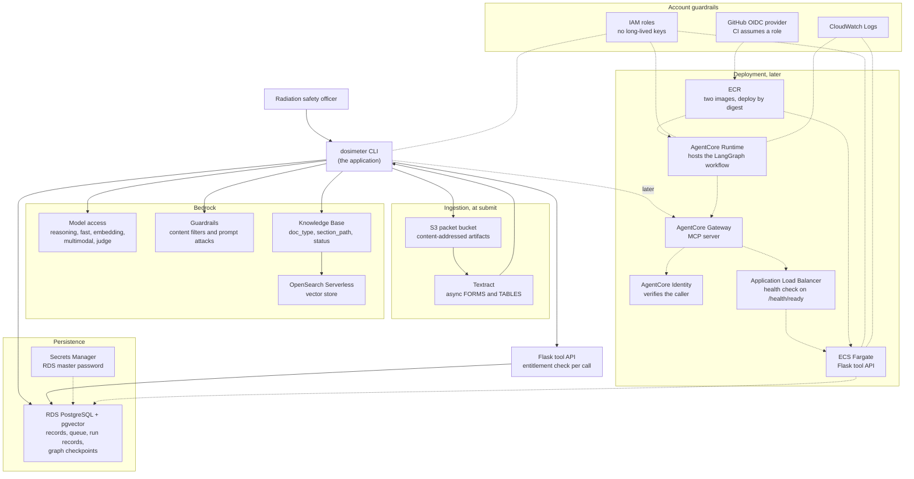

# How the AWS resources fit together

```mermaid
flowchart TB
    officer["Radiation safety officer"]
    cli["dosimeter CLI<br/>(the application)"]

    subgraph ingest["Ingestion, at submit"]
        s3["S3 packet bucket<br/>content-addressed artifacts"]
        textract["Textract<br/>async FORMS and TABLES"]
    end

    subgraph models["Bedrock"]
        bedrock["Model access<br/>reasoning, fast, embedding,<br/>multimodal, judge"]
        guardrails["Guardrails<br/>content filters and prompt attacks"]
        kb["Knowledge Base<br/>doc_type, section_path, status"]
        aoss["OpenSearch Serverless<br/>vector store"]
    end

    subgraph store["Persistence"]
        rds["RDS PostgreSQL + pgvector<br/>records, queue, run records,<br/>graph checkpoints"]
        secrets["Secrets Manager<br/>RDS master password"]
    end

    subgraph deploy["Deployment, later"]
        ecr["ECR<br/>two images, deploy by digest"]
        runtime["AgentCore Runtime<br/>hosts the LangGraph workflow"]
        gateway["AgentCore Gateway<br/>MCP server"]
        identity["AgentCore Identity<br/>verifies the caller"]
        alb["Application Load Balancer<br/>health check on /health/ready"]
        ecs["ECS Fargate<br/>Flask tool API"]
    end

    subgraph ops["Account guardrails"]
        iam["IAM roles<br/>no long-lived keys"]
        oidc["GitHub OIDC provider<br/>CI assumes a role"]
        logs["CloudWatch Logs"]
    end

    officer --> cli
    cli --> s3
    s3 --> textract
    textract --> cli
    cli --> guardrails
    cli --> bedrock
    cli --> kb
    kb --> aoss
    cli --> rds
    cli --> api["Flask tool API<br/>entitlement check per call"]
    api --> rds
    secrets -.-> rds

    cli -.->|"later"| gateway
    gateway -.-> identity
    gateway -.-> alb
    alb -.-> ecs
    ecs -.-> rds
    ecr -.-> ecs
    ecr -.-> runtime
    runtime -.-> gateway
    oidc -.-> ecr

    iam -.- cli
    iam -.- ecs
    iam -.- runtime
    logs -.- ecs
    logs -.- runtime
```
